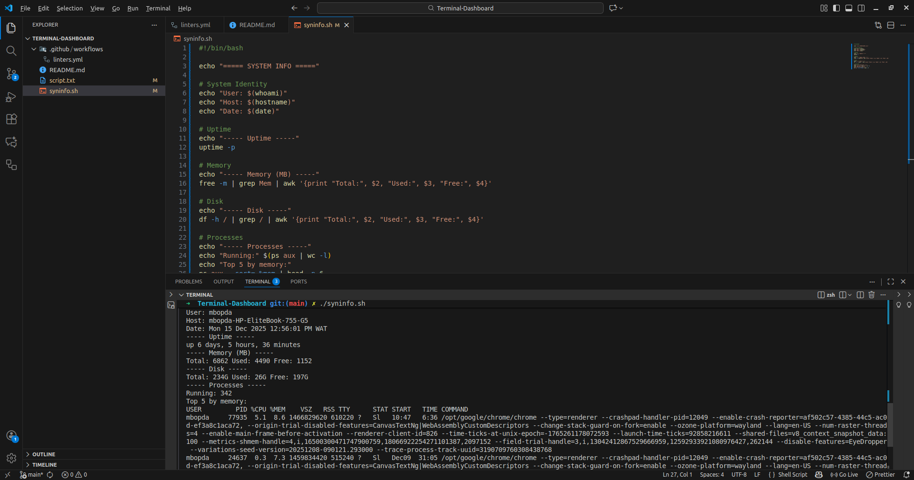

# SYSTEM INFO DASHBORD SCRIPT

<!-- Corrected version: assuming 'dashboard.png' is in an 'assets' folder in your repo -->

<!-- Add more badges from Shields.io as needed, e.g., for build status or version -->

## Overview

This script is designed to track all the information of the machine

## Features

* Highly customizable and responsive design
* Command-line interface for easy interaction/setup
* Automated data fetching and updates

## Getting Started

Follow these instructions to get your copy of the project up and running on your local machine.

### Installation

* .github
* workflows
* linters
* README.md
* script.sh
* sysinfo.sh
 